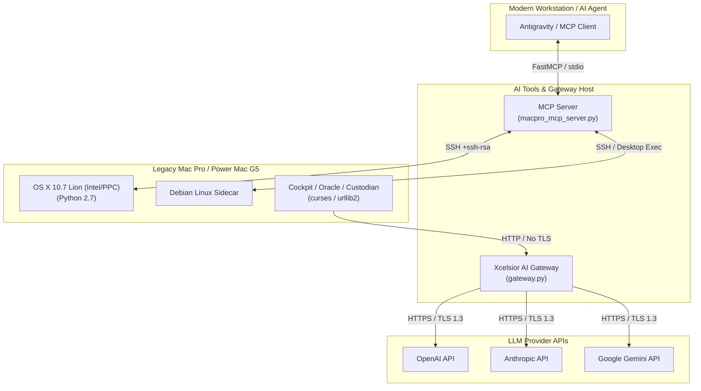

# Mac Pro AI Tools & Gateway (`macpro-ai-tools`)

A full-stack remote management, MCP automation server, and AI gateway for legacy Apple hardware (Mac Pro 1,1 / Power Mac G5 running OS X 10.7 Lion and dual-boot Linux). 

This project bridges the gap between modern AI development environments and vintage hardware, solving protocol mismatches (outdated TLS/SSL implementations, legacy SSH ciphers, python 2.7 stdlib constraints) while providing specialized tools for remote system administration, disk imaging, and AI-assisted terminal interfaces.

---

## 🏗 System Architecture



---

## 🌟 Key Components

### 1. Model Context Protocol (MCP) Server (`macpro_mcp_server.py`)
An MCP server built with `FastMCP` (`MCPServer`) exposing **18 specialized tools** for remote administration and orchestration of the Mac Pro:

#### Raw Primitives & Base Execution
- **`g5_execute_bash(command)`**: Runs raw bash commands via SSH with automatic middle-clipping to preserve error tracebacks.
- **`g5_read_file(path)`**: Reads remote files (safely excludes `.venv`, `.git`, `node_modules` and caps size at 100 KB).
- **`g5_write_file(path, content)`**: Base64-transfers and writes files to avoid heredoc and shell quoting corruption.
- **`g5_run_python(script_content)`**: Executes base64-encoded Python scripts using the remote machine's native Python 2.7.

#### Process & Long Job Management
- **`g5_run_detached(script, job_name)`**: Spawns non-blocking background jobs that outlive standard MCP timeout limits (110s).
- **`g5_job_status(job_name, log_lines)`**: Checks execution status, exit code, and tails logs for detached jobs.
- **`g5_job_progress(process_name, job_name)`**: Monitors real-time progress for file utilities like `ditto`.

#### Administration & Disk Operations
- **`g5_privileges()`**: Checks `sudo` and root execution permissions.
- **`g5_install_app_from_pkg(pkg_path, app_name)`**: Installs `.pkg` installers into `/Applications` without password prompts.
- **`g5_verify_copy(source_path, dest_path)`**: Validates multi-gigabyte transfers using byte size and SHA-1 checksum matching.
- **`g5_disk_layout()`**: Displays full partition tables and mounted volumes.
- **`g5_patch_bootloader(volume, efi_source, expect_sha1)`**: Installs or updates EFI bootloaders on target volumes.
- **`g5_clone_volume(source, dest, job_name)`**: Performs block-level or `ditto` volume replication in a background thread.

#### Subsystem & Virtualization Control
- **`g5_linux_boot_health()`**: Diagnostics for the Linux sidecar instance.
- **`g5_linux_desktop_exec(command)`**: Launches GUI commands on the Linux desktop session.
- **`g5_linux_screenshot(save_dir)`**: Captures the Linux desktop display and returns the image path.
- **`g5_lion_vm_control(action)`**: Controls OS X Lion virtual machine lifecycle (start/stop/status).
- **`g5_lion_exec(command, timeout)`**: Runs commands inside the isolated OS X Lion guest environment.

---

### 2. Xcelsior AI Gateway (`gateway.py`)
A FastAPI proxy microservice designed to handle HTTPS requests on behalf of legacy machines:
- **Problem Solved**: OS X Lion’s native OpenSSL stack lacks support for modern TLS 1.3 standards required by LLM providers.
- **Function**: Accepts plain HTTP API payloads from the Mac Pro over the local network (Tailscale / LAN) and securely proxies them to **OpenAI**, **Anthropic**, and **Google Gemini** using modern `httpx` async clients.

---

### 3. Vintage Mac Pro Terminal Utilities (Python 2.7 Compatible)
Terminal tools formatted for compatibility with Python 2.7.1 and standard OS X Lion dependencies:
- **`cockpit.py`**: A `curses`-based interactive terminal UI allowing seamless switching between OpenAI, Anthropic, and Gemini models.
- **`oracle.py`**: Cyberpunk-themed interactive ChatGPT terminal client ("The Oracle").
- **`g5-doctor.py` ("The Custodian")**: Diagnostic utility that reads OS X system logs (`/var/log/system.log`) via `tail`, sends the excerpt to the AI Gateway, and returns AI-driven diagnostic reports on kernel panics, RAM issues, or thermal failures.
- **`test_client.py`**: Quick diagnostic client to test connectivity and latency against the AI Gateway.

---

## 🛠 Configuration & Environment Setup

Copy `.env.example` to `.env` and fill in your model provider keys:

```bash
cp .env.example .env
```

`.env` template:
```ini
# API Keys for Cloud AI Providers
ANTHROPIC_API_KEY=your-anthropic-key
GEMINI_API_KEY=your-gemini-key
OPENAI_API_KEY=your-openai-key

# Remote Linux Target Settings
MACPRO_LINUX_HOST=192.168.1.124
MACPRO_LINUX_USER=macpro
```

---

## 🚀 Running the Services

### Start the AI Gateway
```bash
# In the virtual environment
source .venv/bin/activate
uvicorn gateway:app --host 0.0.0.0 --port 8080
```

### Run the MCP Server
```bash
python macpro_mcp_server.py
```
Or register `macpro_mcp_server.py` inside your MCP client settings (`~/.gemini/antigravity-cli/mcp/MacPro-G5/` or `claude_desktop_config.json`).

---

## ⚡ Legacy OS OS X Lion Workarounds

| Challenge | Cause | Resolution |
| :--- | :--- | :--- |
| **SSH Handshake Failure** | Modern OpenSSH rejects legacy `ssh-rsa` algorithms. | Forced ciphers in `SSH_OPTS`: `-o HostKeyAlgorithms=+ssh-rsa -o PubkeyAcceptedAlgorithms=+ssh-rsa`. |
| **Script Quoting Errors** | Special characters mangle heredoc transfers over SSH. | All code and file writes are base64-encoded prior to transmission. |
| **Perl Locale Warnings** | OS X Lion emits locale noise on standard command executions. | Automated execution prefix: `export LC_ALL=C LANG=C;`. |
| **Truncated Error Traces** | Standard truncations discard the end of execution logs. | Custom `_clip()` algorithm keeps 65% head and 35% tail, eliding only the middle. |
